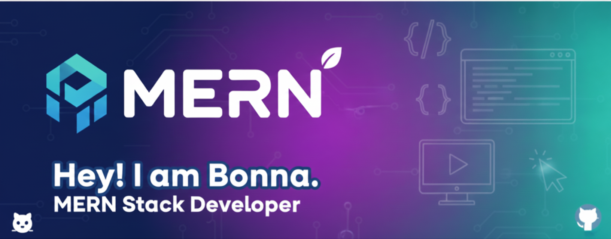

<h1 align="center">Hi 👋, I'm Bonna Akter</h1>
<h3 align="center">MERN Stack Developer | Passionate about crafting modern & scalable web experiences</h3>

  

  

---

### 🚀 About Me
I'm a dedicated **Full Stack Developer (MERN)** with a strong passion for creating interactive, responsive, and performance-driven web applications. I specialize in turning complex design ideas into clean, user-friendly interfaces.

- ⚡ **Currently learning:** Advanced Next.js & TypeScript.
- 🎨 **Interests:** UI/UX trends, Creative Web Design, and Open Source.
- 🔭 **Goal:** Building scalable applications that solve real-world problems.

---

### 🛠️ Languages and Tools

<table width="100%">
  <tr>
    <td width="50%" valign="top">
      <strong>Languages:</strong> 
      
      
      
    </td>
    <td width="50%" valign="top">
      <strong>Frontend:</strong> 
      
      
      
    </td>
  </tr>
  <tr>
    <td width="50%" valign="top">
      <strong>Backend & Database:</strong> 
      
      
      
    </td>
    <td width="50%" valign="top">
      <strong>Tools & Others:</strong> 
      
      
      
    </td>
  </tr>
</table>

---

### 📊 GitHub Stats

  
  

  

---

### 🤝 Connect with me

  
  

